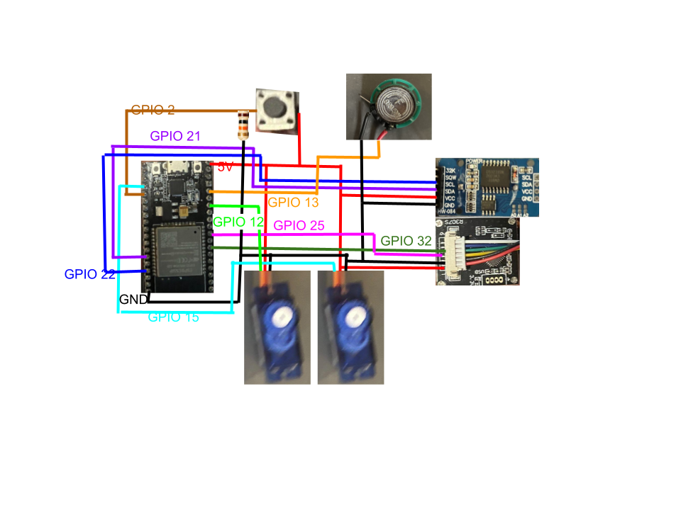
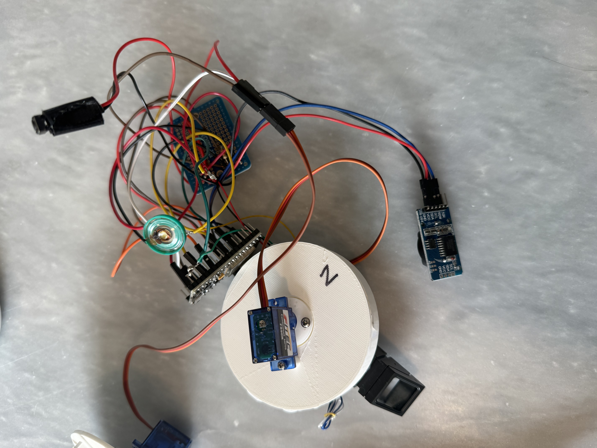
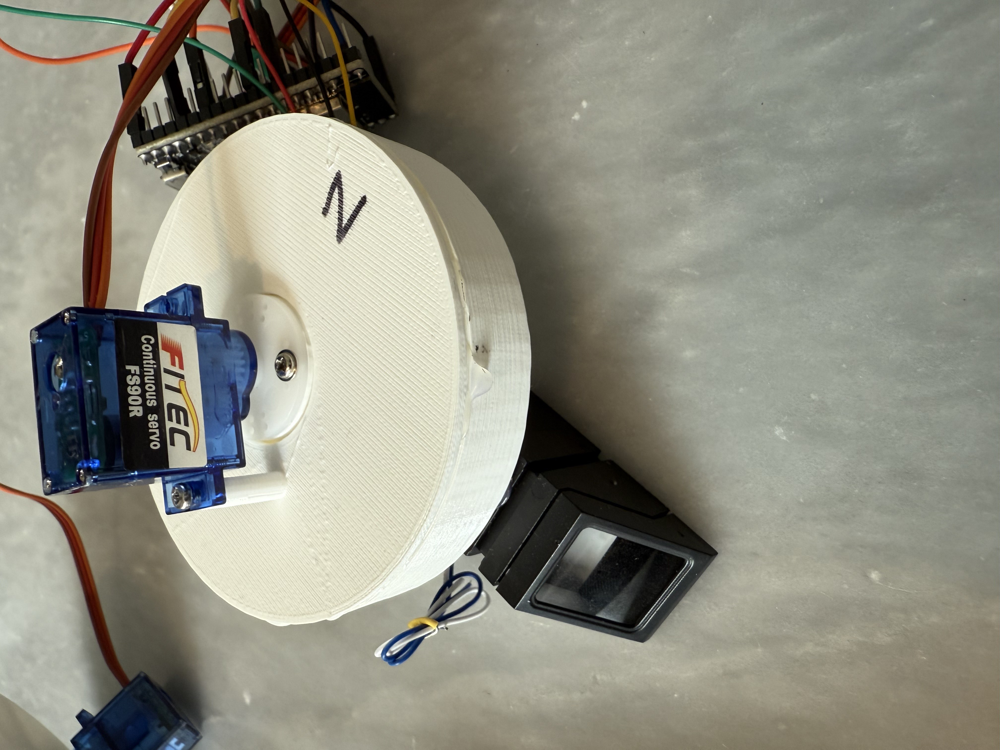
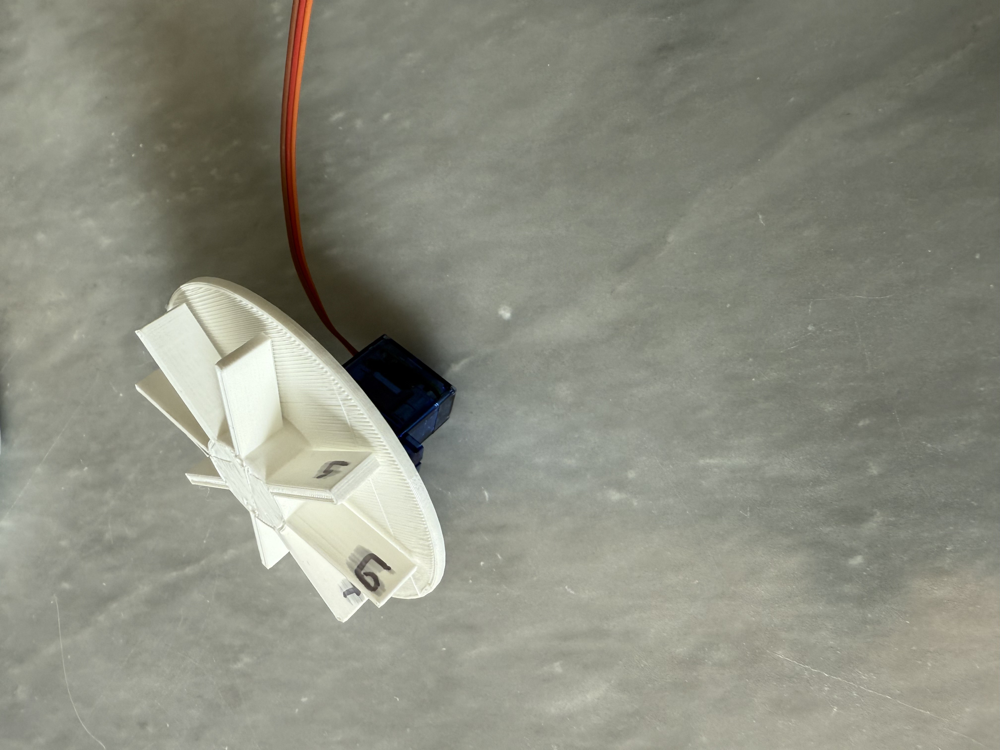

# Pill Safety Device

## Features
- Fingerprint reader to ensure no unauthorized access
- Timers and clocks prevent pills from being taken too early or too late
- Wifi connection to a custom website that allows managers to 
  1. Calibrate the device
  2. Manually override the fingerprint sensor and timing locks
  3. Reload the device with a new week of pills
  d. Reset both the parent and child fingerprints
- A button to enable finger print reads that then starts a process which
  1. Checks if the print is valid
  2. Rotates the corret chamber and overrides time locks if the print is the parent's
  3. Checks if the time for the pill is right and rotates the chamber to allow the child to take the pill

## Application
This device could be used to allow older children to take their own pills without strict supervision since the device ensures they can not take too many pills or take them at the wrong time
Additionally instead of a parent and a child this device could be used by an elderly person and their caretaker.

## Design
#### Materials
- esp32
- servo motors 2x
- 3d printed container and parts (found in cadfiles folder)
- arduino buzzer
- real time clock module
- push button and pull down resistor
- R30x finger print module

#### Schematic

#### Code 
The code can be found in main/main.ino

The finger print module uses code and the library from this repo - https://github.com/brianrho/FPM

###### The remaining libraries used in this project are
- rtclib - real time clock module connections
- esp32servo - allows the esp32 board to connect to standard arduino servers
- wifi
- toneesp32 - enables arduino buzzers to work with the esp32
- esp32 espressif board module - allows hardware serial connections to work

Upon start the device listens for http request and then sends the website piece by piece to the client over an http request. This strucutre was used to allow more versatility in the pages being displayed while also simplifying the code and avoiding the need to create entirley new html files for each webpage. Under normal operation the webserver is unused so the device was programmed to prefer user finger print request initiated by the button press.

## Photos

### Preassembly final assembly all parts

### Rotation chamber with attached finger print sensor

### Sweeper inside the rotation chamber
