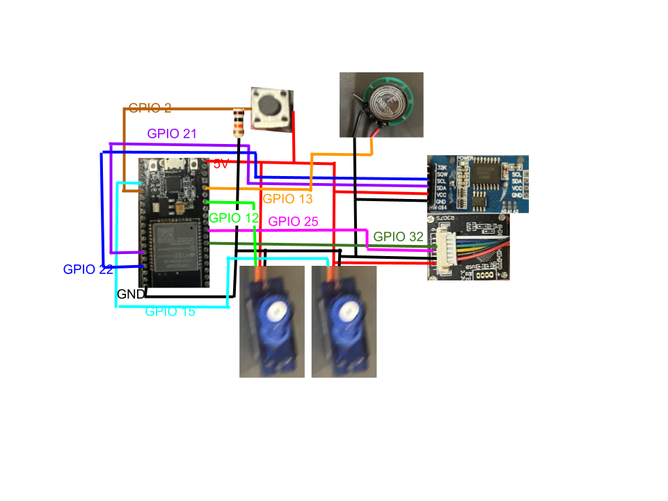
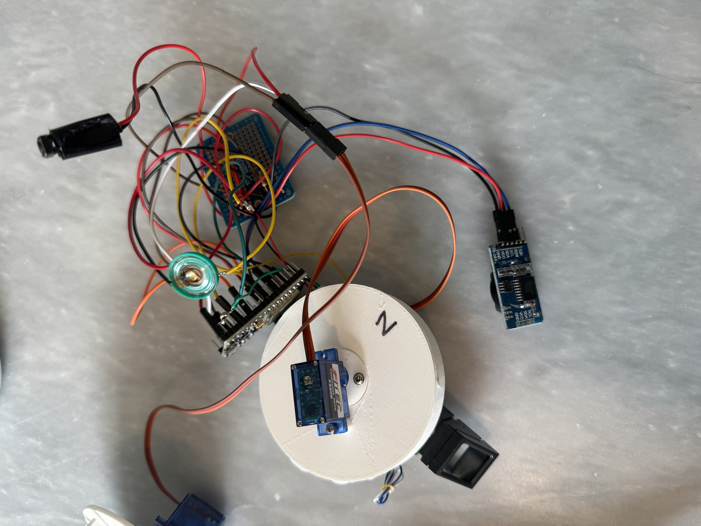
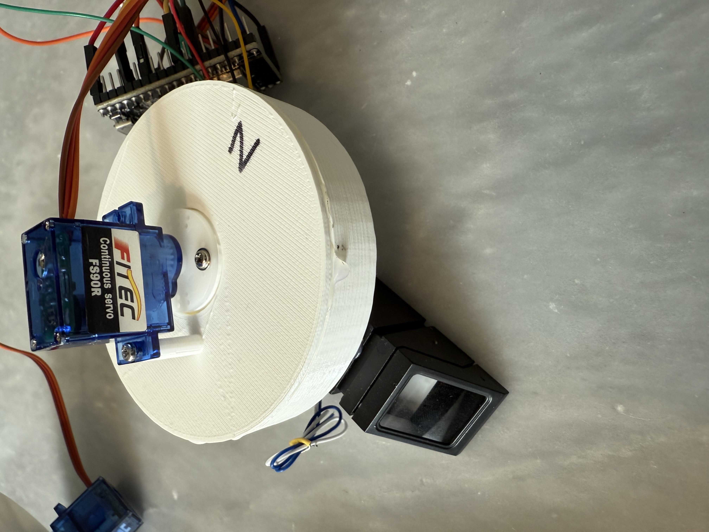
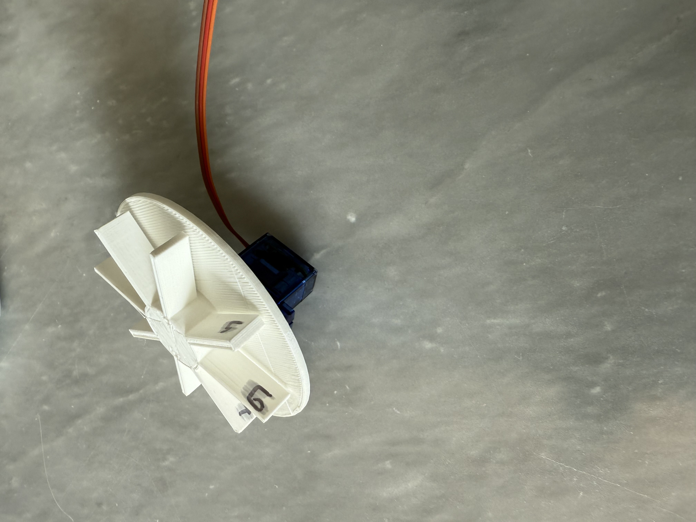

# Pill Safety Device

A smart medication dispensing system designed to promote safe, controlled, and responsible medication use. The device combines biometric authentication, scheduled dispensing, and caregiver controls to help ensure medication is taken only by authorized users and at the correct times.

## Overview

Medication adherence is important for both safety and treatment effectiveness. This project provides a secure medication dispenser that uses fingerprint authentication and a real-time clock to enforce dispensing schedules. Caregivers can manage the device through a built-in web interface, allowing them to configure settings, reload medication, and override restrictions when necessary.

The system is intended for situations where a user is capable of taking medication independently but still requires safeguards against missed doses, accidental overdoses, or unauthorized access.

### Features

* Fingerprint authentication to prevent unauthorized access.
* Time-based dispensing using a real-time clock.
* Audible alerts for missed doses and user feedback.
* Wi-Fi connectivity with a built-in web management interface.
* Caregiver override for fingerprint authentication and dispensing schedules.
* Weekly medication reloading and fingerprint management.

## Applications

Possible use cases include:

* Allowing older children to manage medication safely while remaining under caregiver supervision.
* Assisting elderly individuals with medication adherence while enabling caregivers to retain administrative control.
* Any application requiring controlled access to scheduled medication.

## Hardware

### Components

* ESP32 development board
* 2× servo motors
* R30x fingerprint sensor
* Real-time clock (RTC) module
* Arduino-compatible buzzer
* Push button
* Pull-down resistor
* 3D-printed enclosure and internal mechanisms (located in the `cadfiles` folder)

### Schematic



### Photos

#### Complete Assembly



#### Rotating Chamber with Integrated Fingerprint Sensor



#### Internal Sweeper Mechanism



## Software

### Project Structure

The primary application is located in:

```text
main/main.ino
```

### Libraries

The project uses the following libraries:

| Library                       | Purpose                                   |
| ----------------------------- | ----------------------------------------- |
| FPM                           | Fingerprint sensor communication          |
| RTClib                        | Real-time clock support                   |
| ESP32Servo                    | Servo motor control                       |
| WiFi                          | Wireless networking                       |
| ToneESP32                     | Buzzer support                            |
| ESP32 Espressif Board Package | Hardware support and serial communication |

The fingerprint sensor implementation is based on:

https://github.com/brianrho/FPM

### Firmware Architecture

On startup, the ESP32 initializes the hardware peripherals and starts an HTTP server. Rather than serving a single static HTML page, the firmware generates and transmits each page in sections, simplifying maintenance and making it easier to add or modify interface components.

During normal operation, the web server remains largely inactive. User interaction is primarily driven by the push button, which initiates the fingerprint authentication process. Prioritizing local authentication requests ensures responsive dispensing while still allowing remote administration when required.

## Usage

### Normal Operation

1. Press the activation button.
2. Place a finger on the fingerprint sensor.
3. The device verifies the fingerprint.
4. If the authenticated user is a caregiver, dispensing restrictions can be overridden.
5. If the authenticated user is a patient, the firmware checks whether medication is scheduled for the current time.
6. If dispensing is permitted, the servo rotates the appropriate chamber and releases the medication.
7. Audible feedback indicates the result of the operation.

### Caregiver Functions

Using the web interface, a caregiver can:

* Configure device settings.
* Calibrate the dispensing mechanism.
* Reload a new week's supply of medication.
* Override dispensing restrictions when necessary.
* Register or reset caregiver and patient fingerprints.

## Future Improvements

Potential enhancements include:

* Mobile application for remote notifications and management.
* Secure user authentication for the web interface.
* Encrypted communication between the device and management interface.
* Medication logging and dispensing history.
* Battery backup for continued operation during power outages.
* Cloud synchronization and remote monitoring.
* Support for multiple patients or more complex medication schedules.

## License

This project is licensed under the **MIT License**.

Copyright (c) 2026 Ryan Dalal

Permission is hereby granted, free of charge, to any person obtaining a copy
of this software and associated documentation files (the "Software"), to deal
in the Software without restriction, including without limitation the rights
to use, copy, modify, merge, publish, distribute, sublicense, and/or sell
copies of the Software, and to permit persons to whom the Software is
furnished to do so, subject to the following conditions:

The above copyright notice and this permission notice shall be included in all
copies or substantial portions of the Software.

THE SOFTWARE IS PROVIDED "AS IS", WITHOUT WARRANTY OF ANY KIND, EXPRESS OR
IMPLIED, INCLUDING BUT NOT LIMITED TO THE WARRANTIES OF MERCHANTABILITY,
FITNESS FOR A PARTICULAR PURPOSE AND NONINFRINGEMENT. IN NO EVENT SHALL THE
AUTHORS OR COPYRIGHT HOLDERS BE LIABLE FOR ANY CLAIM, DAMAGES OR OTHER
LIABILITY, WHETHER IN AN ACTION OF CONTRACT, TORT OR OTHERWISE, ARISING FROM,
OUT OF OR IN CONNECTION WITH THE SOFTWARE OR THE USE OR OTHER DEALINGS IN THE
SOFTWARE.

